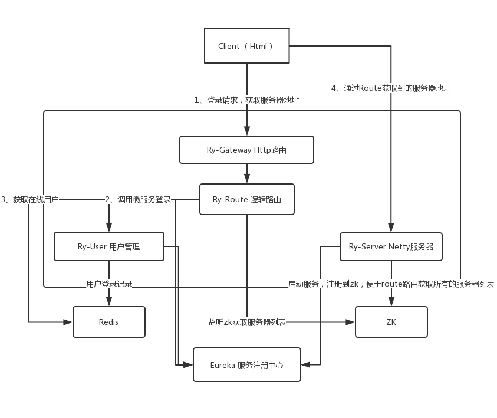

### 基于 Netty 的聊天系统后台

#### 项目将会使用到
- SpringBoot
- SpringCloud
- Netty
- WebSocket
- Vue.js
- Zookeeper
- Redis

##### 访问流程

> 1、前端访问route路由登录，登录成功返回在线用户列表，同时返回该用户需要连接的服务器地址

> 2、连接 Netty 服务器

> 3、消息通过route发送，route根据负载均衡算法找到服务器发送